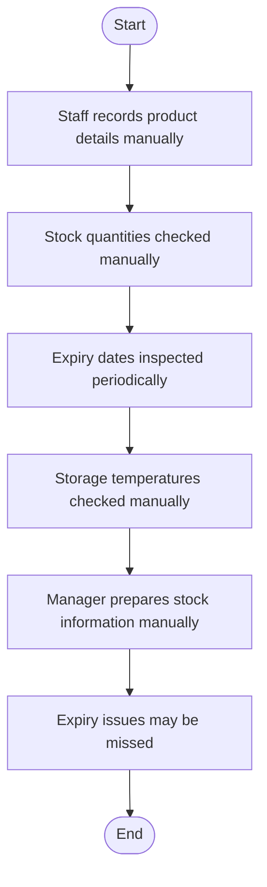

# AS-IS Workflow - Existing Manual System

```mermaid
flowchart TD
A([Start]) --> B[Staff records product details manually]
B --> C[Stock quantities checked manually]
C --> D[Expiry dates inspected periodically]
D --> E[Storage temperatures checked manually]
E --> F[Manager prepares stock information manually]
F --> G[Expiry issues may be missed]
G --> H([End])
```
