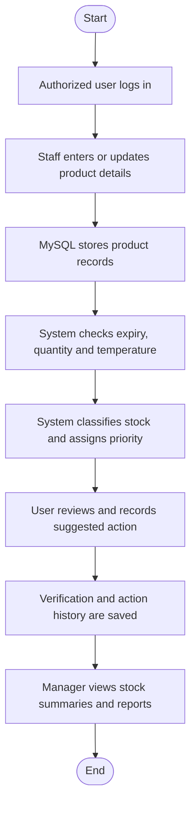

# TO-BE Workflow - FreshFirst System

```mermaid
flowchart TD
A([Start]) --> B[Authorized user logs in]
B --> C[Staff enters or updates product details]
C --> D[MySQL stores product records]
D --> E[System checks expiry, quantity and temperature]
E --> F[System classifies stock and assigns priority]
F --> G[User reviews and records suggested action]
G --> H[Verification and action history are saved]
H --> I[Manager views stock summaries and reports]
I --> J([End])
```
